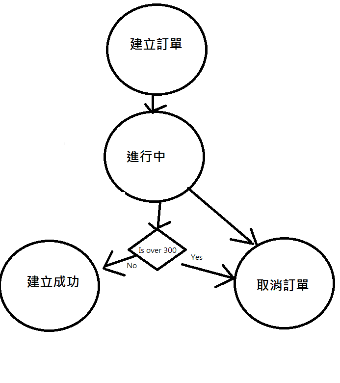

# 狀態者模式

優勢在可將複雜的物件狀態條件,以物件方式來減少條件式的判斷程式

可由物件自身的狀態，決定之後的動作行為.

需求簡易流程如下

這是一個簡單的訂單流程圖



我們可看到從建立訂單開始->最後判斷成功或取消訂單 看似簡單但需要寫一定程度的判斷條件式,而且也要做一定程度的逆向流程防呆.

這裡先貼上 未使用狀態者模式的程式碼: `PaymentContext.cs`

```c#
public class PaymentContext
{
	Product _Item { get; set; }

	PayStatus _status { get; set; }

	public PaymentContext(Product p)
	{
		_Item = p;
		_status = PayStatus.Init;
	}

	/// <summary>
	/// 設置狀態
	/// </summary>
	/// <param name="status"></param>
	public string SetStatus(PayStatus status) {
		string result = $"修改成功{status.ToString()}";
		switch (_status)
		{
			case PayStatus.Init:
				if (status == PayStatus.Init)
					result = "請勿重新建立訂單";
				else
					_status = status;
				break;
			case PayStatus.Success:
				result = "訂單成功請勿修改";
				break;
			case PayStatus.Cancel:
				result = "訂單取消請勿修改";
				break;
			case PayStatus.Processing:
				if (status == PayStatus.Init)
					result = "請勿重新建立訂單";
				else
					_status = status;
				break;
		}


		return result;
	}

	/// <summary>
	/// 跑流程
	/// </summary>
	/// <returns></returns>
	public string RunProcess() {

		switch (_status)
		{
			case PayStatus.Init:
				_status = PayStatus.Processing;
				return "交易建立中...";
			case PayStatus.Success:
				return "交易完成";
			case PayStatus.Cancel:
				return "交易取消完成";
			case PayStatus.Processing:
				if (_Item.Price > 300)
				{
					_status = PayStatus.Cancel;
					return "物件超過300元 交易取消中";
				}
				_status = PayStatus.Success;
				return "交易中請稍後";
		}
		return "不在狀態內";        
	}
}
```

裡面有`SetStatus` 和 `RunProcess` 方法

`RunProcess` 方法 就是將商品一個往下一個流程推進
`SetStatus` 方法 可以改變商品狀態
上面類別中的程式碼 目前有點小複雜但還算簡單,但等日後需求越來越多 後人一直把程式碼寫入`Switch case` 或`if ... else` 中就會導致程式碼越來越複雜

這個情境我們可以嘗試使用**State Pattern(狀態者模式)**

幫助我們將每個自身狀態封裝到物件裡面,由每個狀態來決定後面動作
我們可發現 每個流程都可以使用 `RunningProcee` 和 `SetSatus` 這兩個動作

就可開出一個抽象類別,裡面有這兩個抽象方法,給之後的狀態子類去實現.

```c#
public abstract class PaymentSatusBase
{
    protected PaymentGate _gate;
    public abstract string Running(Product p);

    public abstract string SetSatus(PayStatus s);
}
```

`PaymentGate` 是給外部呼叫端使用的類別,我們可比較上面之前`PaymentContext`類別可看到`if....else` 全部不見了,

因為狀態封裝到各個類別中了

```c#
public class PaymentGate
{
    Product _product;

    internal PaymentSatusBase CurrnetProceess { get; set; } // 這裡擁有下個流程的引用

    public PaymentGate(Product p)
    {
        _product = p;
        CurrnetProceess = new InitSatus(this);
    }

    internal PayStatus CurrnetStatus { get; set; }

    /// <summary>
    /// 設置狀態
    /// </summary>
    /// <param name="status"></param>
    public string SetStatus(PayStatus status)
    {
        return CurrnetProceess.SetSatus(status);
    }

    /// <summary>
    /// 跑流程
    /// </summary>
    /// <returns></returns>
    public string RunProcess()
    {
        return CurrnetProceess.Running(_product);
    }
}
```

 如何新建一個流程物件?
首先我們需要先取得當前使用者使用的 `PaymentGate` 引用並傳入建構子當作參數
實現`Running`和`SetStatus`方法,並將此狀態的邏輯寫上
執行完後需要更改下個流程,可以將值賦予給`CurrnetProceess` 屬性

```c#
public class ProcessSatus : PaymentSatusBase
{
	public ProcessSatus(PaymentGate g)
	{
		_gate = g;
	}
	public override string Running(Product p)
	{
		string result = "交易中請稍後";

		if (p.Price > 300)
		{
			result = "物件超過300元 交易取消中";
			_gate.CurrnetProceess = new CancelSatus(_gate);
		}
		else
			_gate.CurrnetProceess = new SuccessSatus(_gate);

		return result;
	}

	public override string SetSatus(PayStatus s)
	{
		string result = string.Empty;
		if (s == PayStatus.Init)
			result = "請勿重新建立訂單";
		return result;
	}
}
```

說明:

以流程進行中為例子.

他會判斷商品使用超過300元,來決定下個流程 所以我們就把這個邏輯寫在此類中.
 
另外後面幾個流程比照辦理全部搬入類別中

```c#
public class CancelSatus : PaymentSatusBase
{
	public CancelSatus(PaymentGate g)
	{
		_gate = g;
	}
	public override string Running(Product p)
	{
		return "交易取消完成";
	}

	public override string SetSatus(PayStatus s)
	{
		string result = string.Empty;
		if (s == PayStatus.Init)
			result = "訂單取消請勿修改";
		return result;
	}
}


public class SuccessSatus : PaymentSatusBase
{
	public SuccessSatus(PaymentGate g)
	{
		_gate = g;
	}

	public override string Running(Product p)
	{
		return "交易完成";
	}

	public override string SetSatus(PayStatus s)
	{
		string result = string.Empty;
		if (s == PayStatus.Init)
			result = "訂單成功請勿修改";
		return result;
	}
}
```

最後外部程式使用如下

```c#
Product p = new Product();
p.Name = "電腦";
p.Price = 300000;

PaymentGate context = new PaymentGate(p);
Console.WriteLine(context.RunProcess());
Console.WriteLine(context.RunProcess());
Console.WriteLine(context.RunProcess());
context.SetStatus(PayStatus.Init);
Console.WriteLine(context.RunProcess());
```